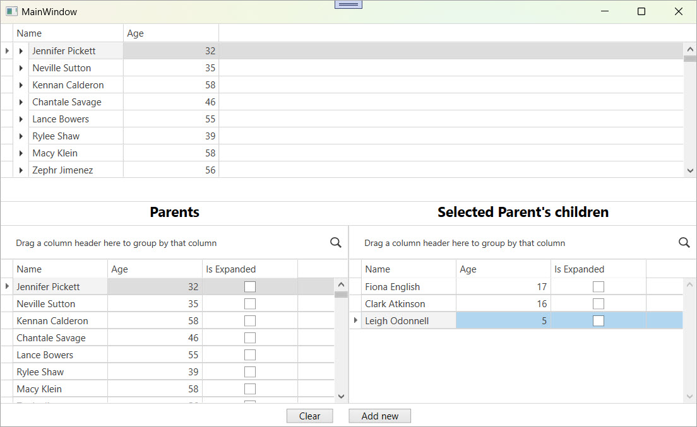

<!-- default badges list -->

[](https://supportcenter.devexpress.com/ticket/details/T127638)
[](https://docs.devexpress.com/GeneralInformation/403183)
[](#does-this-example-address-your-development-requirementsobjectives)
<!-- default badges end -->

# WPF Grid (TreeListView) - Sync TreeListNode Expansion with ViewModel

This example adds two-way synchronization between the expansion state of [`TreeListNode`](https://docs.devexpress.com/WPF/DevExpress.Xpf.Grid.TreeListNode) and a `Boolean` property in the `ViewModel`.



DevExpress does not expose the [`IsExpanded`](https://docs.devexpress.com/WPF/DevExpress.Xpf.Grid.TreeListNode.IsExpanded) property as a `DependencyProperty`, so direct data binding is not possible. This example uses a custom behavior (`BindableExpandingBehavior`) to simulate two-way binding and keep the [`TreeListView`](https://docs.devexpress.com/WPF/DevExpress.Xpf.Grid.TreeListView) state in sync with the underlying `ViewModel`.

You can use this technique to:

* Maintain node expanded state consistency across user sessions.

* Programmatically control expanded/collapsed states from the data model.

* Respond to UI actions through the `ViewModel`.

You can reuse the `BindableExpandingBehavior` in any [`GridControl`](https://docs.devexpress.com/WPF/DevExpress.Xpf.Grid.GridCell.GridControl) that uses a hierarchical `TreeListView`.

## Implementation Details

### Bindable Expanding Behavior

The `BindableExpandingBehavior` class syncs `TreeListNode` expansion with a `Boolean` property in your `ViewModel`:

* Attach the behavior to a `GridControl` and set the `ExpandingProperty` to the name of your `Boolean` property (for example, `IsExpanded`).

* When the `IsExpanded` property changes in the data object, the corresponding node in the tree expands or collapses automatically.

* When a user expands or collapses a node in the UI, the behavior updates the `IsExpanded` property in the bound object.

The logic is handled in two directions:

1. When data changes

```csharp
public void PropertyChanged(object obj, PropertyChangedEventArgs args) {
    if(args.PropertyName == this.ExpandingProperty) {
        var node = FindNodeByValue(obj, treeView.Nodes);
        node.IsExpanded = (bool)obj.GetType().GetProperty(args.PropertyName).GetValue(obj);
    }
}
```

2. When the user expands/collapses a node

```csharp
void GridNodeChanged(object sender, TreeListNodeEventArgs e) {
    var propInfo = e.Node.Content.GetType().GetProperty(this.ExpandingProperty);
    propInfo.SetValue(e.Node.Content, e.Node.IsExpanded);
}
```

### Data Model

`Parent` and `Child` classes both expose the `IsExpanded` property that participates in synchronization:

```csharp
public bool IsExpanded {
    get { return this._IsExpanded; }
    set { this.SetProperty(ref this._IsExpanded, value, "IsExpanded"); }
}
```

Each `Parent` contains a list of `Child` objects, and each `Child` can contain a list of `Toy` objects, creating a three-level tree structure.

The `DataHelper` class generates a large collection of `Parent` objects with nested children.

### Setup View

The main window binds the `GridControl` to an `ObservableCollection<Parent>`. Each `Parent` has a collection of `Child` objects, and each `Child` has a collection of `Toy` items. The `TreeListView` displays this hierarchy across three levels.

To synchronize node expansion with the `ViewModel`, the grid includes the `BindableExpandingBehavior`:

```xaml
<dxg:GridControl ItemsSource="{Binding Parents}" AutoGenerateColumns="None">
    <dxg:GridControl.View>
        <dxg:TreeListView Name="view"
                          KeyFieldName="Name"
                          ParentFieldName=""
                          AutoWidth="True"
                          ShowIndicator="False"
                          ChildNodesPath="Children">
            <dxmvvm:Interaction.Behaviors>
                <local:BindableExpandingBehavior ExpandingProperty="IsExpanded" />
            </dxmvvm:Interaction.Behaviors>
        </dxg:TreeListView>
    </dxg:GridControl.View>
</dxg:GridControl>
```

## Files to Review

* [MainWindow.xaml](./CS/DevExpress.Example04/MainWindow.xaml) (VB: [MainWindow.xaml](./VB/DevExpress.Example04/MainWindow.xaml))
* [MainWindow.xaml.cs](./CS/DevExpress.Example04/MainWindow.xaml.cs) (VB: [MainWindow.xaml.vb](./VB/DevExpress.Example04/MainWindow.xaml.vb))
* [BindableExpandingBehavior.cs](./CS/DevExpress.Example04/BindableExpandingBehavior.cs) (VB: [BindableExpandingBehavior.vb](./VB/DevExpress.Example04/BindableExpandingBehavior.vb))
* [DataHelper.cs](./CS/DevExpress.Example04/Data/DataHelper.cs) (VB: [DataHelper.vb](./VB/DevExpress.Example04/Data/DataHelper.vb))
* [Parent.cs](./CS/DevExpress.Example04/Data/Parent.cs) (VB: [Parent.vb](./VB/DevExpress.Example04/Data/Parent.vb))

## Documentation

* [TreeListNode](https://docs.devexpress.com/WPF/DevExpress.Xpf.Grid.TreeListNode)
* [GridControl](https://docs.devexpress.com/WPF/DevExpress.Xpf.Grid.GridCell.GridControl)
* [IsExpanded](https://docs.devexpress.com/WPF/DevExpress.Xpf.Grid.TreeListNode.IsExpanded)
* [ExpandingProperty](https://docs.devexpress.com/WPF/DevExpress.Xpf.Core.DXExpander.ExpandingProperty)

## More Examples

* [WPF Data Grid - Specify Custom Content for Headers Displayed in the Column Chooser](https://github.com/DevExpress-Examples/wpf-data-grid-custom-content-for-column-chooser-headers)
* [WPF Data Grid - Bind to Dynamic Data](https://github.com/DevExpress-Examples/wpf-bind-gridcontrol-to-dynamic-data)
* [Implement CRUD Operations in the WPF Data Grid](https://github.com/DevExpress-Examples/wpf-data-grid-implement-crud-operations)
* [WPF Grid - Resize Rows Using a Splitter](https://github.com/sergepilipchuk/wpf-grid-resize-rows-using-splitter)

<!-- feedback -->
## Does this example address your development requirements/objectives?

[](https://www.devexpress.com/support/examples/survey.xml?utm_source=github&utm_campaign=how-to-emulate-binding-to-the-isexpanded-property-of-the-treelistnode-t127638&~~~was_helpful=yes) [](https://www.devexpress.com/support/examples/survey.xml?utm_source=github&utm_campaign=how-to-emulate-binding-to-the-isexpanded-property-of-the-treelistnode-t127638&~~~was_helpful=no)

(you will be redirected to DevExpress.com to submit your response)
<!-- feedback end -->
